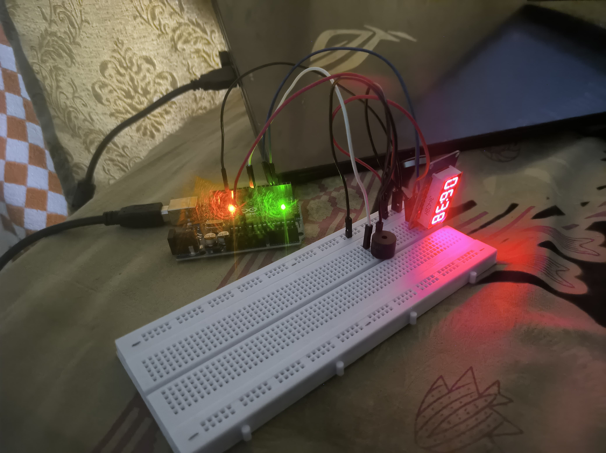

# Pomodoro Timer with Arduino and TM1637 Display

This project implements a Pomodoro timer using an Arduino Uno board, a 4-digit TM1637 display, and a buzzer. It uses a timer to track **Focus** and **Break** periods, with the buzzer sounding at the end of each session.

## Components Required

- **Arduino Uno**
- **TM1637 4-Digit Display**
- **Active Buzzer**
- **Breadboard**
- **Jumper Wires**
- **Battery (for powering the Arduino)**

## Pin Connections

### **TM1637 4-Digit Display**
| **TM1637 Pin** | **Arduino Pin**  |
|-----------------|------------------|
| VCC             | 5V               |
| GND             | GND              |
| CLK             | D3               |
| DIO             | D4               |

### **Buzzer**
| **Buzzer Pin**  | **Arduino Pin**  |
|-----------------|------------------|
| Positive (+)    | D8               |
| Negative (-)    | GND              |

---

## Timer Specifications

| **Session Type**   | **Duration (in minutes)** |
|---------------------|---------------------------|
| Focus Time          | 25                        |
| Short Break         | 5                         |
| Long Break          | 30                        |

---

## Functionality

- **Focus Sessions**: The timer counts down from 25 minutes (1500 seconds) for each focus session.
- **Break Sessions**: After each focus session, a 5-minute break is provided. After every 4th focus session, a longer 30-minute break is provided.
- **Buzzer**: The buzzer sounds 5 short beeps at the end of each session (focus or break). The frequency of the beep is customizable.
- **Display**: The **TM1637 4-digit display** shows the remaining time in **MM:SS** format.

---

## Code Logic Overview

1. **State Transitions**:
   - The timer alternates between **Focus**, **Short Break**, and **Long Break** states.
   - After every 4th focus session, the timer switches to **Long Break** instead of a **Short Break**.

2. **Timer Countdown**:
   - The timer starts with a focus session and counts down each second.
   - The timer switches to break time when it reaches zero.

3. **Buzzer Sound**:
   - When the timer reaches zero, the buzzer beeps 5 times to notify the user.
   - The frequency of the buzzer can be adjusted using the `tone()` function.

4. **Display**:
   - The **TM1637 4-digit display** shows the time left in **MM:SS** format, with a colon blinking during the countdown.

---

## Troubleshooting

- **Buzzer Not Sounding**:  
  - Ensure the buzzer is correctly connected to the Arduino pins.
  - Test the buzzer with a simple script to confirm it's working.

- **No Display Output**:  
  - Ensure the display's VCC and GND are connected to the correct pins.
  - Check the wiring of the CLK and DIO pins.

---

## Installation

1. **Install the TM1637 Library**:
   - Go to **Tools > Manage Libraries** in the Arduino IDE.
   - Search for **TM1637Display** and install the library.
   - Alternatively, you can manually download the library from [GitHub](https://github.com/avishorp/TM1637) as a ZIP file and install it via **Sketch > Include Library > Add .ZIP Library**.

2. **Upload the Code**:
   - Connect the Arduino to your computer.
   - Open the Arduino IDE, paste the code into the editor, and upload it to your Arduino.

---

## License

This project is open-source and released under the MIT License.

---

Feel free to tweak the times or the buzzer frequency to suit your needs! Let me know if you need further clarification or assistance.
